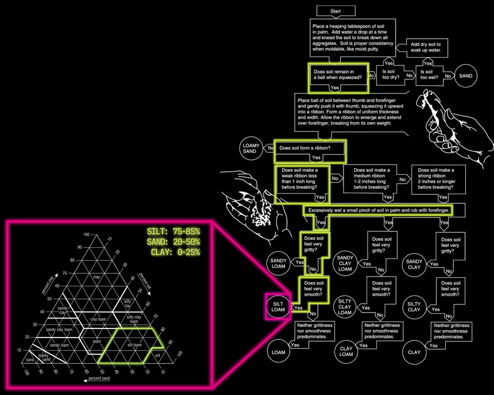

# Agriculture Zero

!!! info 
    
    **==FACULTY==**: Jonathan Minchin

    **==CALENDAR==**: 14-11 → 16-11

    **==TRACK==**: Exploration

!!! tip ""
    ## **Introduction** 
    During the AgriZero seminar, Jonathan introduced us to the complex relationships inherent in agriculture, illustrating its relevance today, just as it was centuries ago. He guided us through various themes including food forests, computational agriculture, and biophilia, shedding light on the intersection of traditional practices and future innovations.

!!! note ""

## Trip to Valldaura Labs

!!! note ""

## Species Analysis

<iframe 
    width="100%" 
    height="400" 
    src="https://www.youtube.com/embed/6M0DoILQM7g?si=p_TeVM5snL8zhxp3&amp;" 
    title="Valldaura Species Analysis" 
    frameborder="0" 
    allow="accelerometer; autoplay; clipboard-write; encrypted-media; gyroscope; picture-in-picture; web-share" allowfullscreen>
</iframe>

!!! note ""

## Soil Analysis

To enhance our ability in recognizing the environment which surrounds us, we were asked to identify some sample soils that Jonathan provided. First, we were introduced to different ways of evaluating soil, and then we conducted the tests. I had the chance to conduct this analysis on ==soil from Benifallet==. Together with Albert, who shared with me his knowledge on the topic, we conducted the following tests:

==Texture Analysis==: 

:   {: .image-45-size-left } By following the methodology displayed, we assessed the soil's texture, which is crucial as it affects the soil's water retention, workability, and fertility. Step by step, we classified it as ==Silt Loam==, characterized by ==75-85% silt, 20-50% sand, and 0-25% clay==.

==Munsell Soil Color Chart==: 

:   {: .image-45-size-left } This tool helps determine the soil's color, providing insights into its composition and condition. The Benifallet soil revealed:

    - ==Hue of 5.0YR==: suggesting a dominant yellow-red color, typical for many soils and possibly indicative of iron oxides.
    - ==Value of 5/==: denoting a soil that is neither very dark nor very light, which implies a moderate organic matter content.
    - ==Chroma of /6==: indicating a distinct and strong color intensity, likely reflecting the mineral composition.
 

==pH Test==: 
:   {: .image-45-size-left } Our analysis measured the soil's acidity, resulting in a pH of 7.6, indicating that the soil is slightly alkaline.

==PO4 and NO3 Tests==

:   {: .image-45-size-left } {: .image-45-size-right } 

Tests for phosphate (PO4) and nitrate (NO3) are crucial for assessing soil fertility, influencing root growth, and plant maturity. The tests yielded low values for both elements, suggesting that, depending on the crop, soil might be supplemented with a fertilizer.

{: .image-45-size-left }

| Parameter | Value      | Analysis   |
|-----------|------------|------------|
| Origin    | Bennifallet|            |
| Texture   | Silt Loam  |  Texture   |
| Munsell   | 5YR 5/6    |  Munsell   |
| pH        | 7.6        |     pH     |
| NO2       | 10 mg/L    |     pH     |
| Cl2       | 3 mg/L     |     pH     |
| GH        | > 16°d     |     pH     |
| KH        | 10°d       |     pH     |
| PO4       | 0.1 mg/L   |    PO4     |
| NO3       | 10 mg/L    |    NO3     |

!!! note ""

## Seed Analysis

!!! note ""

!!! tip ""
    ## **Reflections**

    ...

!!! note ""
