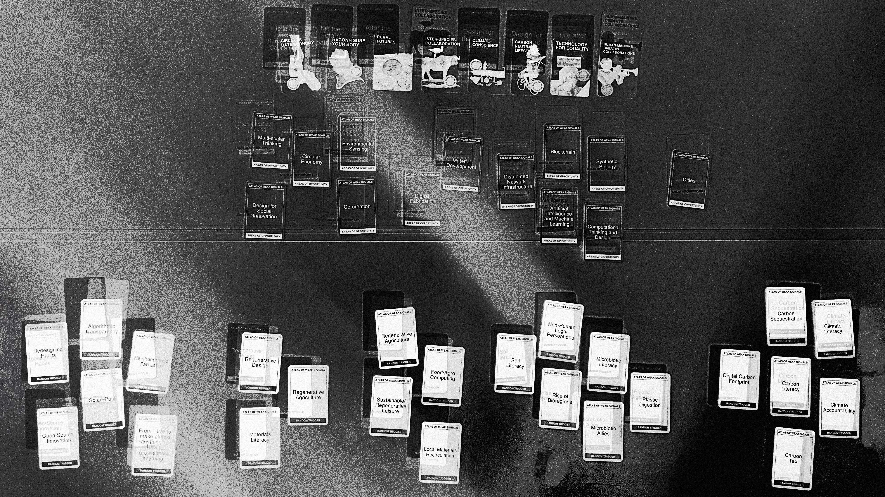
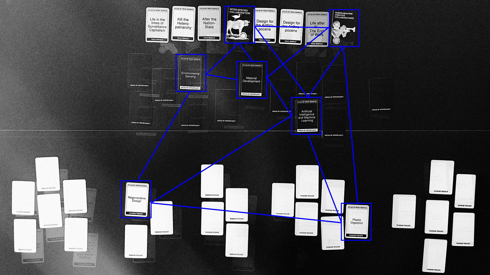
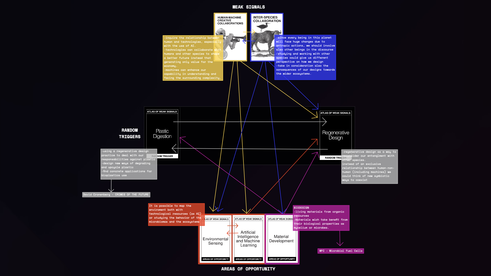
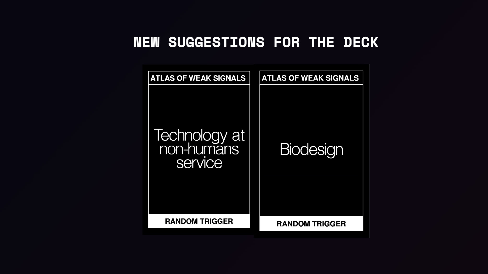
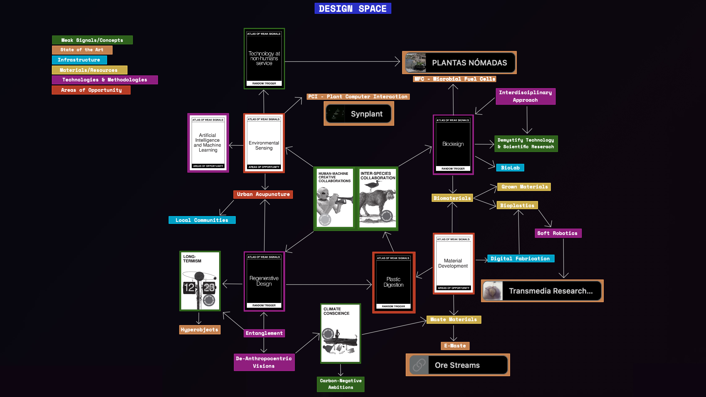

# Atlas of Weak Signals

!!! info 
    ==FACULTY==: Jana Tothill, Roger Guilemany

    ==CALENDAR==: 09-10 → 15-10

    ==TRACK==: Reflection

## ==Weak Signals and Design Space==

Weak signals are an early indicator of change, a small inflection that has the potential to evolve into something more influential.
Weak Signals can help in identifying our own ==Design Space==: a navigational tool in the design practice to ground directions.
The Design Space is a ==visual collection== of projects, references, case studies, materials, used to define ideas and create links.

The key roles of Design Space:

- ==SITUATING==: understand the surroundings and allowing links within to arise.
- ==ORGANIZATIONAL==: reducing complexity, trying to make sense and see which connections arise.
- ==NARRATIVE==: understand your own narrative.
- ==PERFORMATIVE or PARTICIPATIVE==: performative as giving feedback to oneself and participative as combining design spaces.
- ==INSPIRATIONAL==

The goal is to translate this abstract weak signals into actual emergent realities.

!!! note ""

## ==Personal AoWS==

The process that led to the identification of my personal Weak Signals was one of ==de-constructing==. 
Since the cards proved to be very stimulating, using a ==multi-step== methodology turned fundamental to synthesize just a few key concepts. 
For this reason, I first decided to lay all the cards on the table, analyzing them individually. Often, it was necessary to delve deeper into the meaning of some in order to understand them more accurately. Therefore, I proceeded by gradually ==flipping over== the cards that was less relevant for my vision.

Card by card, I was able to first identify the 2 Weak Signals, then move on to the 3 Areas of Opportunity, and finally, the 2 Random Triggers. 
Through this operation, I've come to realize how these few cards were able to encapsulate a significant part of my ethos, and how their combination could generate a multitude of ideas.

**[Click here](https://arc.net/e/1B9CBD1A-605D-4D04-BBA9-039BFF75691F)** to navigate the AoWS.

??? note "New Suggestions"
    

    From the considerations that emerged, I identified two new suggestions for the deck:
    =="Technology at non-humans service"== is an invitation to de-anthropocentric design in which machines coexist with the whole biosphere.
    =="Biodesign"==, on the other hand, is a stimulus for interdisciplinary design aimed at crossing the boundary between design and natural sciences.

!!! note ""

## ==Multiscalar Personal Design Space==

The creation of a Design Space starts in definying the multiscalar consciusness of ourselves.
How do we relate to the ==wide and complex network== that defines our values and our design practice? 

To orientate in between this interconnections, elements in the Design Space are subdivided in:

- ==CONCEPTS & THEMES==: Weak Signals
- ==STATE OF THE ART==: References, case studies and people.
- ==INFRASTRUCTURE & EXTENDED WORKSPACE==: What elements do I dispose in order to develop my design interventions? 
- ==MATERIALS & RESOURCES==
- ==TECHNOLOGIES & METHODOLOGIES==
- ==AREAS OF OPPORTUNITY==: Possible complementary contexts for design interventions.

**[Click here](https://arc.net/e/1A9045F9-656D-42BA-BCFC-90D1D739C62E)** to navigate the Multiscalar Personal Design Space.

!!! note ""

## ==Design Space==

Once having outlined a global overview of my personal design practice, it’s now crucial to refine and organize these principles to define an integrated visualization. This approach aims to interlink each principle, allowing for a seamless flow and a quick, intuitive grasp of the various thematic connections. Now the Design Space is also enriched with case studies and concepts, that might soon evolve in ==Design Interventions==.

**[Click here](https://arc.net/e/A0D1387E-5784-42C5-90FF-E6BCB186F61C)** to navigate my Design Space.