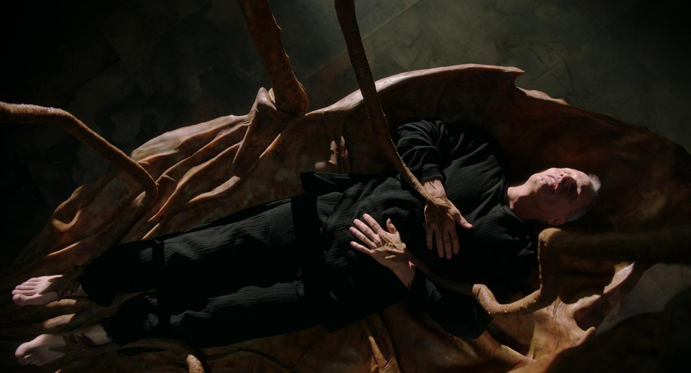

# Biology Zero

!!! info 
    
    **==FACULTY==**: Nuria Conde

    **==CALENDAR==**: 07-11 → 09-11

    **==TRACK==**: Exploration

!!! tip ""
    ## **Introduction** 
    During the Bio Zero Seminar, we had the chance to engage with disciplines beyond design through insights from a researcher in the field, Nuria Conde. Nuria not only introduced us to the fundamentals of biology but also provided a broader perspective on scientific methodology.

!!! note ""

## **GMO Ideation: PhotoElectra**

### **Problem**

==Microbial Fuel Cells (MFCs)== are an innovative technology in the field of renewable energy. These bioelectrochemical systems leverage the metabolic processes of microbes to generate electric power. However, despite their promising potential, MFCs face significant challenge for their ==performance limitations== such as slow microbial growth rates, resulting in ==lower power outputs==.

### **Concept**

1. ==Electron Transfer in Geobacter sulfurreducens==:
    
    A key feature of *Geobacter sulfurreducens* is its ability to transfer electrons out of the cell to external acceptors like electrodes. This is accomplished through a series of proteins, including various c-type cytochromes and conductive pili. These proteins facilitate the movement of electrons out of the cell, which can be harnessed for electricity generation in microbial fuel cells.
    
2. ==Photosynthesis in Cyanobacteria (Synechocystis sp. PCC 6803)==:
    
    Cyanobacteria absorb solar energy through photosynthetic pigments (like chlorophyll) in their thylakoid membranes. The absorbed energy excites electrons, which are then transferred through a series of proteins in the electron transport chain. This process generates ATP (adenosine triphosphate), which is used for various cellular activities.

The integration of *Geobacter sulfurreducens*'s electron transfer capabilities with the enhanced photosynthetic ability of the cyanobacterium *Synechocystis sp. PCC 6803* could potentially lead to a system that converts solar energy into electrical energy. 
The transfer of electrons generated during photosynthesis in cyanobacteria to an external electrode, facilitated by proteins derived from *Geobacter*, represents an approach to bioelectrogenesis.

### **Process**

Introduce genes responsible for electron transfer in *Geobacter sulfurreducens* (like cytochrome and pili genes) into cyanobacteria.
The goal is to divert some of the electrons generated during the light reactions of photosynthesis towards the *Geobacter* derived electron transfer system.
The electrons transferred through the *Geobacter* derived electron transfer system need to be directed to an external electrode.
This can be achieved by growing the genetically modified cyanobacteria on an electrode surface within a microbial fuel cell.
As the cyanobacteria perform photosynthesis, they will generate electrons that are passed to the external electrode via the *Geobacter* derived electron transfer pathway. This flow of electrons to the electrode creates an electrical current, which can be harnessed for power generation.

### **Genes**

The genes responsible for electron transfer in *Geobacter sulfurreducens* include several type c cytochromes and genes associated with pilus formation. Key genes are:

1. ==**OmcS** and **OmcZ**==: Important outer membrane cytochromes involved in electron transfer to electrodes and other metals.
2. ==**PilA**==: Involved in the formation of conductive pili, playing a significant role in electron transfer.
3. ==**GSU3274**==: A gene encoding a monoheme c-type cytochrome; its deletion completely inhibits electron transfer from electrodes.

!!! abstract "References"
    - https://doi.org/10.1111/j.1462-2920.2006.01065.x
    - https://doi.org/10.1016/j.bioelechem.2022.108101
    - https://doi.org/10.1016/j.bioelechem.2010.07.005
    - https://doi.org/10.3389/fmicb.2023.1150091
    - https://doi.org/10.1016/j.bios.2023.115524
    - https://doi.org/10.1111/j.1462-2920.2006.01065.x

!!! note ""

!!! tip ""
    ## **Reflections**

    This week has been touching for me, striking me like a cold shower. 
    I had thought that my previous projects gave me a rough idea of what it's like to design with biology, but I've realized I've only just scratched the surface.

    When Nuria introduced us to the possibilities within ==synthetic biology==, I was at a loss for how to react. Some of these experiments seemed like they were straight out of a sci-fi movie, yet they are very much real, and we're often simply unaware of their existence.
    What truly captivated me, beyond the biological information itself, were the ==ethical discussions== surrounding these experiments, particularly in synthetic biology. Questions arise about who sets the limits of research and its ==social implications==. Nuria emphasized how people outside the academic sphere are often oblivious and lack agency  in the decision-making process of research, even though the outcomes of this research could significantly alter and intertwine with their lives.

    
    These reflections also brought to mind a movie that has profoundly influenced me: =="Crimes of the Future" by David Cronenberg==. 
    In the movie, there are people who have developed the ability to ==eat and digest plastic==, an evolutionary trait in response to the increasing pollution and pervasiveness of plastic in the environment.
    These characters represent how the line between natural and artificial is blurring: their ability to consume plastic reflects a deep connection and interdependence with the human-altered environment. Moreover, they are ==outcasts from society as no-longer-humans==, and the movie emphasises the ethics of this choice considering that this ability is actually a ==benefit to the entire ecosystem==. Through these characters, Cronenberg raises questions about the ethics of the mutability of the human body, and the potential future conflicts that these may arise.
 
    In the meantime, researching on GMOs has really deepened my understanding of the unique features inherent in every living being. This immense variety of abilities is prompting me to consider our relationship with what enhances our abilities as humans: technology. I think that concepts like ==analogue or slow computing== are really something we can learn from other organic beings.

!!! note ""