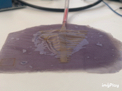

# Design Studio 01

!!! info 
    
    **==FACULTY==**: Jana Tothill, Roger Guilemany 

    **==CALENDAR==**: 09-10 → ...

    **==TRACK==**: Application

## **1PP Design Interventions**

- ==EXPERIENTIAL==
- ==CRAFTING==
- ==AUGMENTING==
- ==SOCIO-POLITICAL==

However, the challenges could be working with materials at hand and putting yourself at risk, dealing with ==real world complexity==.

!!! note ""

## **Roles of Prototyping**

1. ==THE PROTOTYPE AS AN EXPERIMENTAL COMPONENT==  
Hypotheses physically embedded in the artifact.

2. ==THE PROTOTYPE AS A MEANS OF INQUIRY==  
An instrument to collect, record and measure phenomena. 

3. ==THE PROTOTYPE AS A RESEARCH ARCHETYPE==  
Research archetypes are physical embodiments of concepts, understandings or design spaces. These prototypes are principally exemplary and illustrative, even (and especially) when they are exposing confrontational or contradictory scenarios.

4. ==THE PROCESS OF PROTOTYPING AS A VEHICLE FOR INQUIRY==  
The process of making a prototype is instrumental in doing design research.
In these role, the process becomes a means of inquiry, akin to a research method.
The process is documented, analysed, critically assessed and written up, and the research contribution is tied not to the artefact itself as much as to how the artefact was crafted.

!!! note ""

## **Roles of Prototyping [Personal Experience]**

1. ==**ZIGO-** → THE PROTOTYPE AS AN EXPERIMENTAL COMPONENT==  
    

    ZIGO- is a rehabilitation program focused on hand injuries, where the central component is the homonymous controller, which allows finger contractions with varying resistance levels tailored to the patient’s condition. Accompanied by a videogame experience, the device facilitates consistent exercise and enables doctors to monitor rehabilitation progress. Prototyping has been a fundamental tool that allowed to ==refine the product design and functionality==. Through multiple iterations, we were able to identify the optimal shape, based on hand grip and considerating the respective percentiles. 
    **[Click here](https://nicolobaldi.com/ZIGO)** to visit ZIGO-'s page.
      

2. ==**GAIA** → THE PROTOTYPE AS A MEANS OF INQUIRY==   
       

    GAIA was conceived in a workshop led by Marisa Satsia, focused on Soft Robotics. This prototype is intended to represent a hybrid breathing entity, crafted from a fusion of bioplastic and electronic circuits.
    Adopting principles from the field of Soft Robotics, the prototype aims to inquire our perception of technology, examining the ==intersection of synthetic and organic elements==, offering a thought-provoking perspective on the evolution of technology and its integration with organic matter
    **[Click here](https://www.instagram.com/p/CxLCxMMI7XF/?utm_source=ig_web_copy_link)** to visit GAIA's page.
      

3.  ==**MI·MÈ·SI** → THE PROTOTYPE AS A RESEARCH ARCHETYPE==  
    

    MI·MÈ·SI is a research centered around the combination of different materials, aimed at renew traditional artisanal practices for adaptation to contemporary contexts. Driven by a multitude of experiments, the role of the final artifacts was ==not to define end-products==, instead, it focused on their potential (especially in terms of visual communication) to ==showcase the potential of the research==. 
    **[Click here](https://nicolobaldi.com/MI-ME-SI)** to visit MI·MÈ·SI's page.
      

4. ==**SPIRA** → THE PROCESS OF PROTOTYPING AS A VEHICLE FOR INQUIRY==  
    

    During the development of SPIRA the goal was to fabricate closed chambers from upcycled plastic sheets, which would serve as habitats for microalgae cultivation. This aim was achieved through the use of a ==laser cutting machine to weld the sheets==, employing a technique derived from the field of Soft Robotics. Given that this technique has been sparsely documented and experimented with, ==the prototyping phase was all about exploration==.   
    The initial stages of research have focused in meticulously calibrating the machine's parameters, aiming to establish an effective welding. Following this, the focus shifted towards enhancing the adhesion between the plastic sheets. Various strategies were tested to improve precision and effectiveness in the prototyping process. 
    The use of acrylic sheets held in place with magnets, the application of preliminary guides, and the implementation of double welding techniques were instrumental in refining the process. 
    These trials and adjustments (and their documentation) helped to understand the machine as well as the fabrication process in the optimization of a technique. 
    **[Click here](https://whimsical-furniture-2bf.notion.site/SPIRA-ENG-f9d433bcbbe9413eabf8a8f6daf761e6?pvs=4)** to visit SPIRA's page.

!!! note ""

## **Extended Workspace**

!!! note ""

## **Exercise with [Sophie Marandon](https://sophma.github.io/myMDEFportfolio/home.html)**

Sophie’s research provides a ==comparative analysis of the populist discourse== acknowledged in the tweets of Marine Le Pen (MLP) and Jean-Luc Mélenchon (JLM). Key characteristics of populist discourse include: the glorification of the people, estrangement of the elite, exclusion of outsiders who don't share the same identity, nostalgia for the nation's symbolic traditions, and a depiction of the leader as the authentic voice of the people. Sophie also used a ==Natural Language Processing==, an Artificial Intelligence model capable of understanding human language, in order to develop a ==Sentiment Analysis== of the selected tweets. 
Sophie's project embeds a broader analysis on communication and the utilization of social media by political parties. Therefore, her prototype aligns with the ==3rd Role of Prototyping==, serving as a tangible demonstration of her research.
  
After discussing the project together with Sophie, we became aware of the ==opacity== surrounding the way social media curate information for users. These algorithms, which shape our perceptions of news, politics, and culture, operate within a =="black box"==, making it challenging for users to decrypt their working. 
The connections between pieces of information, and the reasons why certain elements are prioritized over others, remain concealed.

To address this, we conceived the idea of a ==browser add-on==, powered by AI, that can ==deconstruct the interface of social networks==. 
This tool would serve as an ==overlay==, providing insights into why a particular tweet, post, or comment is presented to the user. 
Contrary to the common belief that social media and technology are neutral entities, our tool aims to shed light on the underlying biases and conflicts. This would be crucial to emphasize a more transparent relationship between users and digital media.

This tool aligns more with the ==2nd Role of Prototyping==, as its primary goal is to reveal the underlying phenomena users encounter during their use of social media. 

!!! note ""
