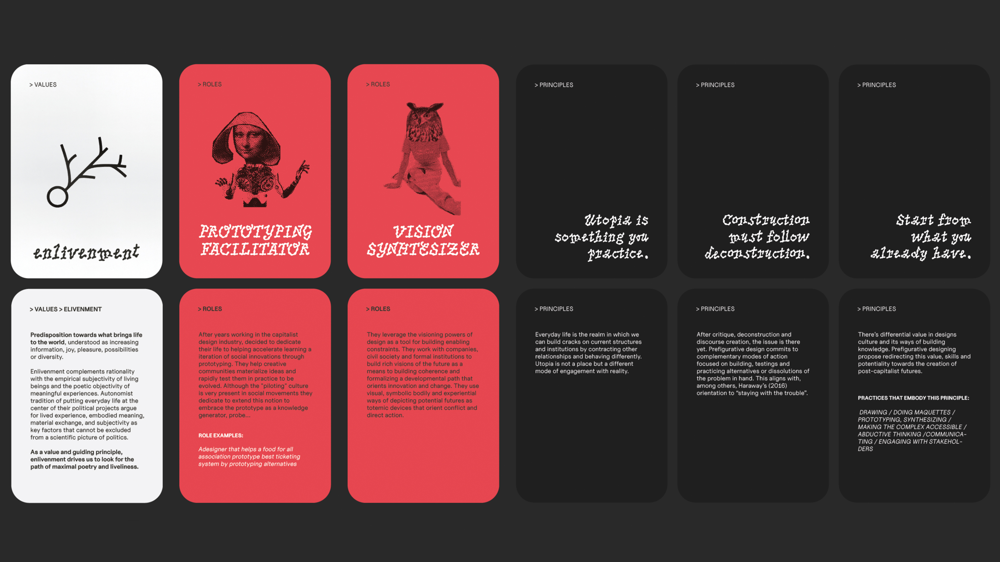

# **Design With Others**

!!! info 
    
    **==FACULTY==**: Holon

    **==CALENDAR==**: 21-11 → 24-11

    **==TRACK==**: Reflection

!!! tip ""
    ## **Introduction** 
    Dividing the seminar into 4 phases (Soil, Land, Connect and Intervene), we were asked to reflect on the benefits and the frictions that interacting with a community leads to. Thanks to the guidance of Holon, we were exposed to different communities around Barcelona, having the chance to collect their experience in working with & within others.

!!! note ""

## **Soil & Land**

{: .image-upscale-ctr }

!!! note ""

## **From Micro to Macro**

!!! info "**Team**"
    
    Albert Vila Bonfill, Anthuanet Falcon, Dhrishya Ramadass, Emmanuel Pangilinan, Flora Berkowitz, Francisca Herrera, Nicolò Baldi

### **Identifying the Issue**

The lack of microspaces for biodiversity in the urban space.
==Why this is an issue?==
- When we don’t see benefit for humans it is very difficoult to plan for biodiversity.
- The biodiversity is still part of the ecosystem of the city, it’s just that it’s ignored.
- Understanding and “apply” biodiversity has the potential to improve the quality of life in the urban space.
- Biofilia.
- The importance of education.
- There is a lack in between data/knowledge and tangible interventions.
    
==Which are the inside conflicts?==
- The side effects of these choiches
- Not everyone has the privilege to question and redefine its behaviour on these topics.
- Finding compromises in between humans/non-humans requires lot of effort, time and care.
- Understanding this topics sometimes requires both systematic and personal changes.

!!! note ""

### **Identifying the Communities**

- Educambient (Teaching Community): https://educambientcoop.wixsite.com/educa
- Espai Ambiental (Teaching Community): https://espaiambiental.coop/
- Salvem El Jardì (Community Garden): http://salvemeljardi.blogspot.com/p/jardi-del-silenci.html
- Bioma (Common Hort): https://www.instagram.com/bioma.cat/
- Education Agro: https://pamapam.org/directori/arran-terra/
- Huerto: https://pamapam.org/directori/hort-font-trobada-poble-sec/

!!! note ""

### **Video**

<iframe 
    width="100%" 
    height="400" 
    src="https://www.youtube.com/embed/aSSOlwAWv4w?si=cKappHEf6AWai6VK" 
    title="YouTube video player" 
    frameborder="0" 
    allow="accelerometer; autoplay; clipboard-write; encrypted-media; gyroscope; picture-in-picture; web-share" allowfullscreen>
</iframe>

!!! note "" 

!!! tip ""
    ## **Reflections**

    Having the opportunity to interact with real communities almost without any filters allowed us to truly grasp what it means to design collaboratively. During our visits, we were able to ==ask questions and directly experience their work environment and projects==, dispelling the mystery that often surrounds the backstages of design studios. This experience provided us with a realistic understanding of both the possibilities and challenges of these approaches, while also introducing us to potential future peers.

    Personally, I've found this experience extremely valuable: although we quickly realized that ==forming a strong bond with communities takes time and energy==, this brief initial engagement has provided the groundwork for building more resilient relationships in the future.
!!! note ""