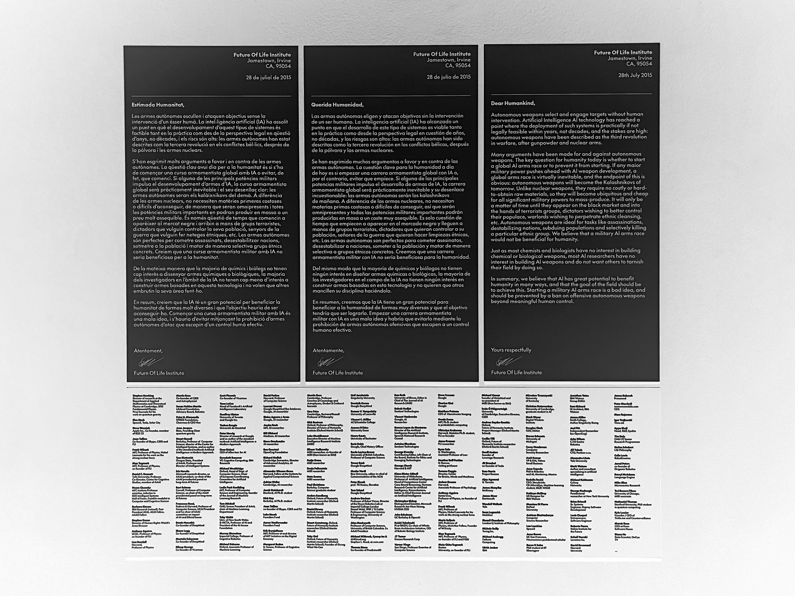
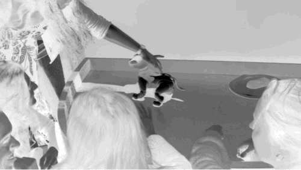
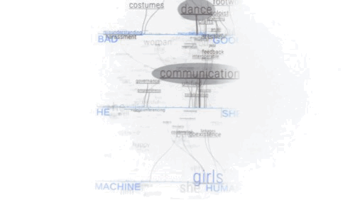

# Extended Intellligences 

!!! info 
    
    **==FACULTY==**: Estampa    

    **==CALENDAR==**: 28-11 → 05-12

    **==TRACK==**: Exploration

!!! tip ""
    ## **Introduction** 
    Thanks to the guidance of Taller Estampa, in this seminar we explored the diverse and potential applications of AI, ranging from aesthetic to functial enhancements. We gained basic knowledge of AI development and tools, from researching datasets to selecting AI models understanding the key concepts of training and coding.

!!! note ""

## **CCCB: Expo Intel•ligència Artificial**

During the visit to “Expo Intel•ligència Artificial” at CCCB, we were asked to choose a few pieces from the exhibition that interested us the most.

==FLI LETTER (2015) & SONY AIBO (2018)== 

:   {: .image-45-size-left } 
    {: .image-45-size-right } 
    

    The first two pieces that I selected have two completely different purposes: a letter from the Future of Life Institute, dated 2015, addressing the risks of AI development for war applications, and the game-robot Aibo from Sony. I’ve chosen this contrast because it proved to me that the line between fascination and fear for technology is very thin, and it also exposes how technology is never impartial or neutral as we tend to think.
    It’s interesting, and sometimes scary, that similar technical advancements are in some cases directed towards ==purposes of violence, power, and control==, and at the same time as tools for ==empathy and playfulness==. Aibo also demonstrates our sensitivity towards the ==design== of these artifacts, since an aesthetic that focuses its attention on the eyes allows us to empathize more with it, influencing us with the ==Kawaii effect==; military robots from Boston Dynamics surely evoke different feelings from their design.

    The letter from 2015 is not a dystopian-future fear, as a similar event was repeated in May 2023 with the 22-words ==“Statement on AI Risk”==, signed by AI scientists, policymakers, and journalists to warn about the risk of extinction that AI could lead to:

    > “Mitigating the risk of extinction from AI should be a global priority alongside other societal-scale risks such as pandemics and nuclear war.”

    I think it's fundamental not to have an Illuministic approach to new technical developments, but instead a critical one, which enables us to understand how they work behind their black box and to consider their conflicts. This idea resonsates with a quote from ==Nam June Paik==, the pioneer artist of video art:

    > “I use technology in order to hate it more properly.”

==WATERFALL OF MEANING==

:   {: .image-upscale-ctr }

    The other piece that I selected is “Waterfall of Meaning”, a ==visual installation== which allows one to write words that an AI classifies into ==binary groups: good/bad, he/she, human/machine==. This project made me reflect on a concept highlighted by Taller Estampa during one of their lectures: 

    > “AI is the most accurate representation of our society today”.

    I agree with this statement because the process of developing AI has its roots in datasets and data-mining with the related biases. Since AIs have been trained on this past knowledge, ==like a psychologist, they are able to track and expose our deep-rooted conflicts==. I think that the binary system shown by the project is the representation of how our society leads us to choose between opposite directions, without considering all the gradients of alternatives in the middle.

!!! note ""

## **Green Guardian**

!!! info "**Team**"
    
    Carmen Robres, Jorge Muñoz, Nicolò Baldi, Oliver Lloyd

### **Value Proposition Statement**

**Value Proposition Statement**

|**Concept Name:**      | Green Guardian                  |
|-----------------------|---------------------------------|
| **Using:**            | Pictures of healthy and sick plants |
| **To:**               | Info about plant care           |
| **We can help:**      | Bad "parents"                   |
| **With a better way to:** | Take care of plants         |
| **With/Without:**     | Knowledge and healthier plants  |
| **Because/So That:**  | Better understanding of nature  |

!!! note ""

### **Confusion Matrix**

**Confusion Matrix**

|                   | **Positive (+)**                             | **Negative (-)**                             |
|-------------------|----------------------------------------------|----------------------------------------------|
| **True (+)**      | What does a ==true positive== look like? The machine *correctly* identifies the plant as *healthy*. | What does a ==false positive== look like? The machine identifies the plant as *healthy even though it’s sick*. |
| **False (-)**     | What does a ==false negative== look like? The machine identifies the plant as *sick even though it's healthy*. | What does a ==true negative== look like? The machine *correctly* identifies the plant as *sick*. |

!!! note ""

### **Code Demo**

<iframe 
    width="100%" 
    height="400" 
    src="https://www.youtube.com/embed/yW7W0c9UYr0?si=-LJoCJYsUfzOIqe4" 
    title="YouTube video player" 
    frameborder="0" 
    allow="accelerometer; autoplay; clipboard-write; encrypted-media; gyroscope; picture-in-picture; web-share" allowfullscreen>
</iframe>

!!! note ""

!!! tip ""
    ## **Reflections**

    Dummy text goes brrrrrrrr

!!! warning 
    The grammar of this texts has been corrected by Chat-GPT. ( ͡❛ ͜ʖ ͡❛)

!!! note ""