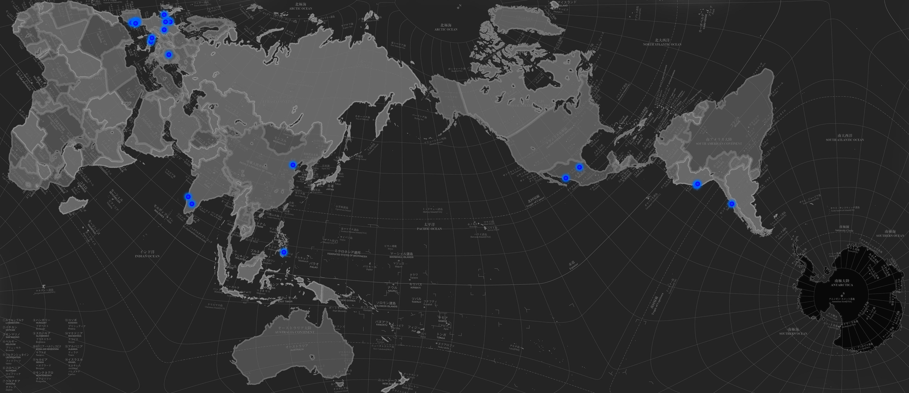

# Landing

!!! info 
    ==FACULTY==: Guillem Camprodon, Tomas Diez, Laura Benitez

    ==CALENDAR==: 02-10 → 06-10

    ==TRACK==: Application

!!! success ""
    ## **Introduction**

    The landing week has been designed to ease our transition and immerse us in our new environment in Barcelona. It’s an exciting introduction to our journey, showcasing IaaC’s spaces, labs, and the culturally rich communities of Poblenou.

!!! note ""

{: .image-upscale-ctr } 

!!! note ""

!!! tip ""
    ## **Reflections**

    During my first week at IaaC, I had the incredible opportunity to meet my classmates. We are a diverse group, not only in terms of cultural origins but also in our professional backgrounds. 
    The idea of combining our ideals and experiences to share this journey together is truly exciting. <3

!!! note ""
