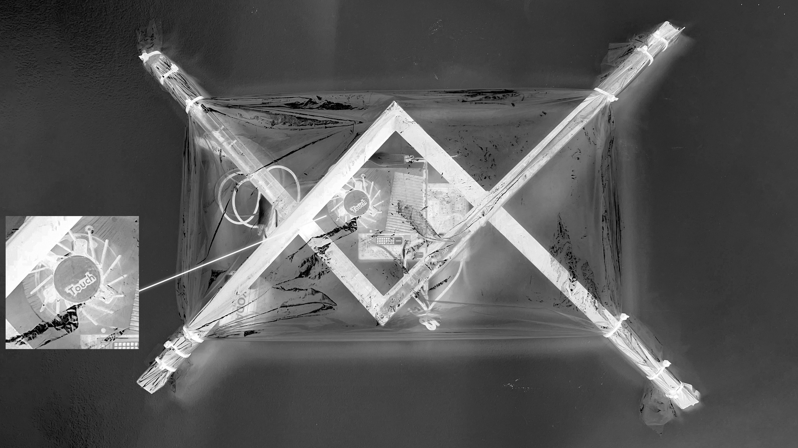
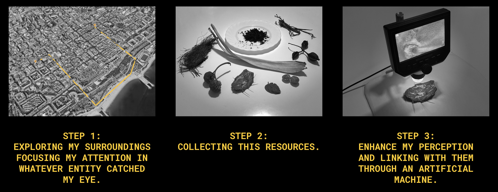

# Living With Your Own Ideas 
!!! info
    
    **==FACULTY==**: Oscar Tomico, Kristina Andersen, Angella Mackay  

    **==CALENDAR==**: 31-10 → 03-11

    **==TRACK==** Reflection

## **Introduction**

Dummy text goes brrrr

!!! note ""

## **Make a (living/non living) companion**

==Tranquility==: the need to be secure and protected

### **Re.flection²**

- ==HOW WILL YOU LIVE TOGETHER?==   
    Each day, me and Re.flection² will designate a specific time to engage with one another. Re.flection² will position itself between me and my mirror, and through its core, an hypnotic rotating fan, we’ll have the chance to shed our tendencies to overthink, guiding our focus towards seeking inner tranquility.
      

- ==WHAT DOES IT NOTICE?==   
    Re.flection² aids in interrupting the regular flow of my thoughts, prompting a moment in which to breathe and find calm. Its repetitive motion and its filtering materials allow us to do that.
      

- ==WHAT WERE YOU THINKING?==   
    Upon my initial encounter with Re.flection², I was struck by how its semi-transparent layer could perfectly encapsulate the notion of feeling sheltered. Protection is not about hiding, it’s about embracing the complexity and contradictions that reside beneath our surface. Positioning Re.flection² before a mirror is a method of confronting our personal selves and making peace with that vision.   

- ==WHY DOES IT MATTER?==   
    For me, Re.flection² serves as a tangible reminder of the importance of dedicating time to oneself.   

{ .image-full-width }

!!! note ""

## **Closer Intimacy**

<iframe 
    width= "100%" 
    height= 400 
    src="https://www.youtube.com/embed/bKqNPPYdQKM?si=sXRIXdUaIUU0ZxuX" 
    title="YouTube video player" 
    frameborder="0" 
    allow="accelerometer; autoplay; clipboard-write; encrypted-media; gyroscope; picture-in-picture; web-share" allowfullscreen>
</iframe>

- ==WHAT DID YOU MAKE? AND WHY DID IT MATTERS?==

    

    The inquiry for my 1PP intervention emerged from the cards I chose within my Design Space, which focused on ==Human-Machine Creative Collaboration== and ==Inter-Species Collaboration==. I found myself enquiring about the reasons behind my care of this triangle of co-existence and how I might immerse myself in these profound topics through my personal experience. I reflected on my daily interactions with machines and non-human entities and realized how machines can enhance our understanding of our relationships with non-humans. They really extend our perception and could act as a medium for connecting with our environment. This inspired me to ==gather various natural entities around Poblenou== —those that caught my eye, the ones I typically overlook in my everyday life and rarely consider. I then used a ==digital microscope== to explore them, establishing a connection among myself (a human), an artificial apparatus (the microscope), and other species (the entities I collected). 

    Viewing these entities through the microscope, I was able to enhance a deeper connection with them, and it was quite touching to observe them so closely. The machine offered more than just a technical feature; it gave me the chance to remember that I am always part of a broader ecosystem, one in which fractal patterns reign.  

- ==WHAT HAPPENS WHEN YOU INVOLVE YOURSELF? WHAT HAPPENS WHEN YOU USE YOURSELF AS AN INSTRUMENT?==  

    I believe that personal involvement is fueled by one's own ==ideals==. 
    When you internalize and believe in these values, you are actively and personally engaged in your pursuits. If these ideals are deeply held, they can help in not getting influenced by side interests, allowing to focus more immersively into your objectives.
    Moreover, this practice leads to a ==deeper self-understanding==, as constant interaction with our own principles facilitates personal growth and insight.  

- ==DID ANYTHING CHANGE ABOUT YOUR WAY OF WORKING?==   

    I consider myself an idealist, so the idea of guiding my projects through my ideals wasn't novel to me, however, I've come to truly appreciate the ==importance of constantly documenting the process behind==. I believe this transparency not only showcases the extent of your personal commitment but also conveys your passion and dedication to others far more effectively than any impersonal approach could.  

- ==WHAT DOES IT MEAN FOR YOUR FUTURE WORK?==   

    I will keep in mind what this experience has taught me and I am keen to ==further research== on exploring natural environments through the help of technology.  

- ==AFTER SEEING THE VIDEOS OF YOUR DESIGN SPACE COLLECTIVE, HOW DOES IT CHANGE YOUR UNDERSTANDING OF IT?== PRESENT NEW OPPORTUNITIES OR INSPIRE NEW POSSIBILITIES FOR COLLABORATION.   

    I feel like that everyone in the group had a small opportunity to deviate from the established rules of “Design Thinking”, allowing us to delve into a more ==introspective== approach to design. It was intriguing to observe how each one engaged with this task in their unique way, and I believe this divergence has ==enriched our understanding of one another==.
    I would be really curious to gain a deeper understanding of ==Anthuanet’s perspective on rituals==. I believe incorporating a more spiritual approach into our projects could yield new fascinating dimensions, and I think this could also relate to my own concepts of symbiosis in between humans-machines-non/humans.  

!!! note ""

