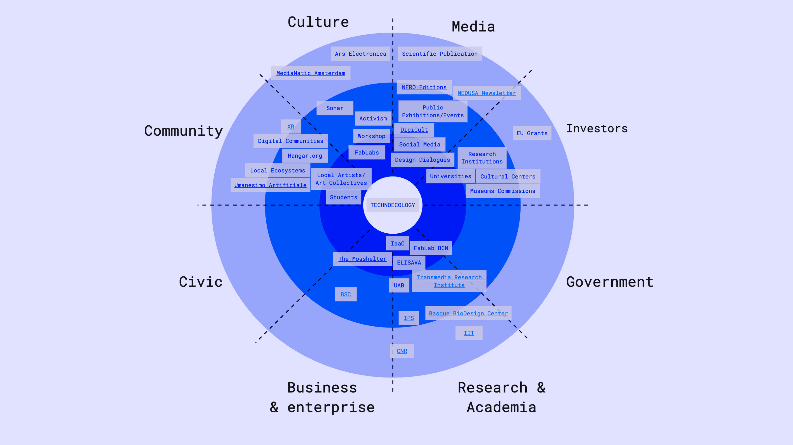

# Communicating Ideas

!!! info 
    
    **==FACULTY==**: Pablo Zuloaga    

    **==CALENDAR==**: 16-01 → 31-03

    **==TRACK==**: Reflection

## Tandem (3) Interview

!!! info "**Team**"

    Albert Vila Bonfill, Everardo Castro Torres, Nicolò Baldi

<iframe 
    width="100%" 
    height="400" 
    src="https://www.youtube.com/embed/uJcjDwr-P6c?si=E9n77YbCukScl7wv" 
    title="YouTube video player" 
    frameborder="0" 
    allow="accelerometer; autoplay; clipboard-write; encrypted-media; gyroscope; picture-in-picture; web-share" allowfullscreen>
</iframe>

!!! note ""

## Technoecology
### Project Vision

<iframe 
    src="https://docs.google.com/presentation/d/e/2PACX-1vSyn5TtdGdBB-KGHd-1ZwO-6JmwxwqENpcrNKT5Wl-BzBx6EWjuxArNQl8ed3SU6Nt6JUOLFiJ5Vu8_/embed?start=false&loop=false&delayms=3000" 
    frameborder="0" 
    width="100%" 
    height="400" 
    allowfullscreen="true" 
    mozallowfullscreen="true" 
    webkitallowfullscreen="true">
</iframe>

### The Core

==WHAT?==
: Highlight how the environment is changing due to our perception and use of technology.
Disrupt our conception of developing new technologies with technocratic solutions, instead stimulate alternative ways which co-operate with the ecological state.

==HOW?==
: Education, Interdisciplinary Research, Open Source Strategies, Artistic Expression.

==WHY?==
: There is a urgent need to cooperate in between the different disciplines to resist the polycrisis we are facing.
The ways we are now addressing the ecological crises are not working, so it's important to take a step back and reconsider both the concepts of technology and ecology.
At the same time, we need to keep hope and imagine new futures through a powerful narration, without referring only to a specialised and academic public.

### Stakeholders & Communication Strategy

