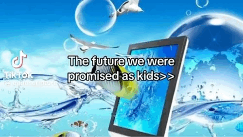
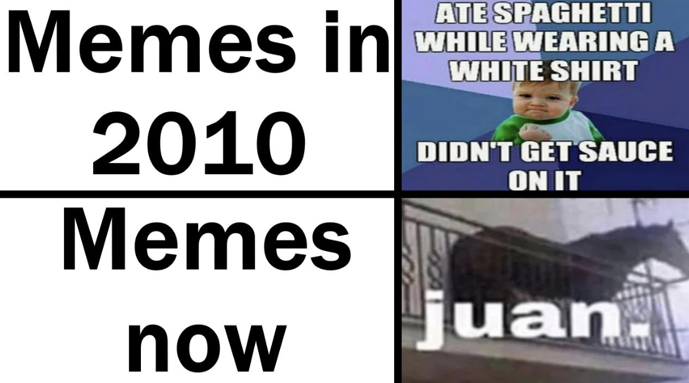

# Design for Collective Intelligence

!!! info 
    
    **==FACULTY==**: Jessica Guy, Olga Trevisan 

    **==CALENDAR==**: 23-01 → 26-01

    **==TRACK==**: Exploration

!!! note ""

!!! info "**Team**"

    Dhrishya Ramadass, Francisca Herrera, Marius Schairer, Nicolò Baldi, Oliver Lloyd, Sophie Marandon

!!! note ""

## **FasciNation: Life Under the Regime**

### **Brainstorming**

- Trying to convert and change mind of the most extremist politicians in history (?)
- Summary/prediction of current politician positions (?)
- ==Educational VR game to immerse in an extremist context (?)==
- You can’t leave the game (?)
- Interaction may be to ridiculize, or to promote discussion (?)

### **Scenario**

We highlighted how ==extremist political parties are increasing worldwide==, especially focusing on hate speeches and discrimination.
The "solution" we are proposing is to take advantage of open platforms like Dafne and techniques as gamification to enhance open discussions around these topics.

### **Governance and Rules**

The idea is an educational tool which shows how life would be living an authoritarian regime.
This tool is a videogame which can be  downloaded from a repository directly from the Dafne platform.
In the game, the player is a journalist who lives in this extreme reality, whose goal is to interact with the world and the other characters.
The dialogues with the characters are recorded on a notebook, as well as the player observations on the interactions.

### **Artifact**

At the end of the game, the page of the notebook with the reflections becomes the resulting artifact from the experience.
The user is also prompted to create an avatar of the extremist leader that represents the world which they have visited. These avatars are then minted as NFTs and distributed on the platform.
This 3D object becomes an NFT, each of these collection showing a personal point of view and reflection on the topic in order to promote discussion.
The funds raised from the sale of the these NFTs would be distributed by a DAO towards de-radicalisation efforts.

### **Presentation**

https://docs.google.com/presentation/d/1atsNCe_Hxqf4ZJxCj44dJRo8bkvx_AQqchnPYdz6tGg/edit?usp=sharing

!!! note ""

!!! tip ""
    ## **Reflections**
    
    ### **The Magic of Technology**

    

    I’ve been very fascinated by the relationship that AX Mina highlighted in between technology and magic. 
    Paradoxically, I think that our context today mirrors that of our ancestors thousands of years ago. In fact, ==animistic and magical thinking== once helped humans make sense of the world, attributing meaning to phenomena and artifacts. In a similar way, we now turn to ==technocratic solutions== for every super-wicked problem humanity faces, assuming that a way to provide answers and solve issues through technology is always possible.

    This discourse helped me to reconsider my own relationship with technology as well.
    I was already quite critical about Accelerationist and Illuminist scenarios in which an imaginary technological progress could empower the whole humankind, and honestly I think that technology itself is never enough to perceive the world. It helps, but it’s not the whole of it. 
    I’m also quite annoyed of discussions on technology which only cover futuristic or anthropocentric scenarios: ==humans are not the only beings to develop technology==, and also, in between the whole technologies that humans already have developed and the ones that still have to come, ==the most powerful is and will always be language and communication==.
    Those reflections prompted me some questions: Why did I grow up this way? Why I was thought that a problem just needs the right technology to be solved? How can we change this perception in future generations? 

    

    Additionally, AX Mina's discussion on how physical and digital realities influence each other through memes resonated with me. Having grown up with memes since the early 2010s, I've observed their evolution and how they reflect our changing reality, filled with ==complex layers of meaning, symbolism, and lore==. This echoes [Valentina Tanni's "Memestetica"](https://www.instagram.com/p/C2-I4srodiw/?utm_source=ig_web_copy_link) which explores the societal impact of these digital phenomena.

    ### **DAO, NFTs, Blockchains...**

    To be honest I’ve always seen the concepts of NFTs and Blockchains as a wasted opportunity for alternative applications, and ==I have always been skeptical about them==. 
    The NFT boom in 2021, however, sparked in me a naive interest about Digital Arts: I started to explore various digital galleries and discover new artists and new ways to make art.
    It was disheartening to me to later realize that the ==NFT system had largely devolved into a mechanism for financial speculation==, with the only purpose of generating and transfer huge amounts of capital.

    This week it was a relief to see attempts to ==repurpose these technologies, and gave me hope for their potential==.
    I like to remember to myself that no technology falls from the sky, and each one has its own impact, and speaking of the Digital Wallet/Crypto system, I think that the amount of energy that is needed to support this systems is mostly overlooked. The concept of Digital Ecology is really something to consider if we really want to apply these technology in our present and future reality.
    In fact, these discussions also gave me an idea about a potential application of the Blockchain system (I still haven’t researched enough about it so I don’t know if similar applications have already been studied).

    It came to my mind a particular case study about Intel's effort to trace its own supply chain, ensuring its microprocessors avoided tantalum from Congo. Intel has over 19,000 suppliers across 100+ countries for materials, machinery, packaging and logistics, and it took 4 years to the company to have a decent evaluation of this chain. 
    This highlights the ==huge challenges companies face in maintaining a responsible supply chain, and the impossibility of external to evaluate and trust these companies==. 
    Therefore, I believe that ==applying blockchain technology in this context could be beneficial==. Establishing a parallel between a transparent information chain in the public domain and the supply chain of companies could encourage companies to make greater efforts in tracing their products' life cycles. 
    Also, it could enable customers to hold accountable those who do not adhere to these standards. 
    ==Today's supply chains involve critical discussions on worker safety, minimum wages, ecological impacts, and extraction techniques==. Blockchain technology could illuminate these aspects, which are often invisible in the final product.

    ### *Political Gamification*

    

    Our project has led me to consider how political ideas can be conveyed through videogame. ==Gamification can open up discussions on divisive topics==, bridging the gap between the seemingly contrasting worlds of gaming (associated with entertainment and light-heartedness) and politics (marked by serious ethical debates). 
    But the thing is that every game has a political message behind, even the ones which seems not to relate at all with politics. 
    For example, most of strategy and management games like “SimCity”, “Animal Crossing”, and even “Farmville” ==promote a neoliberal capitalist mindset through their gameplay mechanics==. 
    Similarly, games like “Wolfenstein”, “Tropico”, “Power and Revolution”, and “Papers, Please” have ==explored themes of geopolitical tension and dictatorship==, proving that the gaming world can indeed reflect and critique political realities.

    <iframe 
    style="border-radius:12px" 
    src="https://open.spotify.com/embed/track/2yXKOBQQ2Hx9hJ2HuzOxP8?utm_source=generator" width="100%" 
    height="152" 
    frameBorder="0" allowfullscreen="" allow="autoplay; clipboard-write; encrypted-media; fullscreen; picture-in-picture" loading="lazy">
    </iframe>

!!! note ""