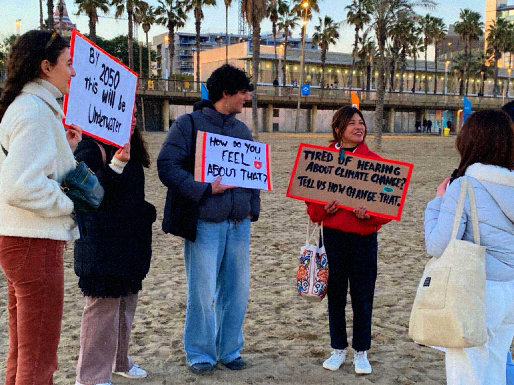
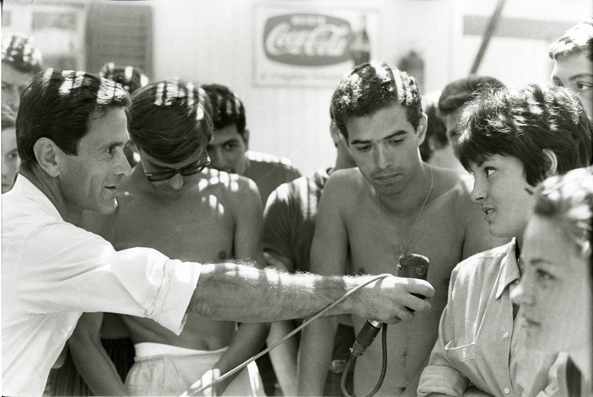

# Designing in a State of Climate Emergency 

!!! info 
    
    **==FACULTY==**: Andres Colmenares    

    **==CALENDAR==**: 09-01 → 12-01

    **==TRACK==**: Reflection

!!! tip ""
    ## **Introduction** 
    Learning the words which describes our contemporary, learn our relationship with our space and time, learn to open ourselves in critical and divisive topics. 

!!! note ""

!!! tip ""
    ## **Reflections**
    ### **Positionality**

    One of the first steps of the week was to assess our positionality statement. Personally, it was not my first time discussing about the concepts of ==privilege and power==, but something in these collective talks helped me to have a deeper consciousness.

    I've been fairly aware of my privileges, but this consciousness led me to different reactions over time. 
    There were moments when I ==felt guilt or discomfort== about these privileges, viewing them as something negative about my persona which I couldn't escape or renounce.
    Later on, I understood how ==having privileges doesn’t necessarily entail adopting the behaviours of those who take advantage of their position==, instead, these behaviors are shaped by our ==personal values== and awareness. The "wheel of Power/Privilege" was a useful tool in reminding me of my place in the world and in finding peace with it.

    ### **Polycrisis & Loss of Imagination**
    
    Acknowledging these words during the seminar has not felt as learning them from a dictionary. It was more like discovering them from the inside and feeling connected with them, as they have always been somewhere in me. 

    I didn’t know about the term polycrisis, but I really think it sums up lot of my inner thoughts which i’ve already had in the past. Once taking consciousness of the meaning of the word, it seemed to me very obvious that all these crisis have always been connected to each other. 
    I think that the most dangerous outcome of the polycrisis is the ==escalation of hate== which carries with it: every individual or community which is affected by one of these crises keeps getting angrier and angrier, trying to find a specific target to blame. 
    If we multiply this phenomena across the spectrum of the polycrisis, it seems so difficult to imagine a future in which discussion, dialogue and mediation are possible.

    This ties into the idea of a =="general loss of imagination"== too. The precarious and critical global state of “survival” not only generates hate in between each other, but also doesn’t allow us to imagine new alternative futures. 

    Personally, When I first became engaged with ecological issues, my actions were driven by a strong desire to play my part in mitigating the problem. While I still value and participate in such practices, I've realized that this approach limited the attention on my feelings, as I believed that making "right" choices alone could have “solved the problem”. 
    Imagination is as important as reflective choices to keep the hope alive.

    ### **Taking Action**

    

    Although I feel deeply involved with discussions about climate crisis, I was very embarrassed and somehow scared of exposing myself in a sort of ==activism==. Honestly I’ve never participated to public demonstrations or protests, preferring to form opinions in solitude (which allows to feel much safer). 
    Even though this was just a small experience, I think it has been a meaningful step in understanding what ==self exposure== really means.  

    Since I'm naturally inclined towards ==introspection==, often prioritizing thought over action, sometimes it’s not easy for me to act and expose myself in matters I deeply care about.
    I also had quite low expectations about the experiment, but they immediately turned out to be wrong. 
    Talking to strangers in a real-world context was truly amazing, giving us the chance to discuss with them peacefully and without any scripts. Their genuine appreciation for our initiative and the ==constructive interactions== that ensued were priceless.

    

    In a way, this intervention reminded me of ==“Comizi d’Amore”==, a movie from 1964 by the Italian director ==Pier Paolo Pasolini==. 
    This movie is one of the first ever “investigative film”, in which Pasolini himself went all around Italy asking common people about their views on a delicate and taboo topic of the time: sexuality.
    He interviewed people from children to elders, and the authenticity and the diversity of their answers is what really makes the viewer feel part of them. The movie highlighted the power and value of ==open discussion, especially on critical topics==, and how it can foster a strong sense of ==solidarity==. 

    I really hope to keep on exposing myself. <3

!!! tip "BONUS"
    Speaking of Solar-Centered Design, every time I think of the Sun, this song always comes to my mind <(￣︶￣)>	

    <iframe style="border-radius:12px" 
    src="https://open.spotify.com/embed/track/0HgSaG6pYR3Nlt45GQyrKp?utm_source=generator&theme=0" 
    width="100%" 
    height="152" 
    frameBorder="0" 
    allowfullscreen="" 
    allow="autoplay; clipboard-write; encrypted-media; fullscreen; picture-in-picture" 
    loading="lazy"></iframe>