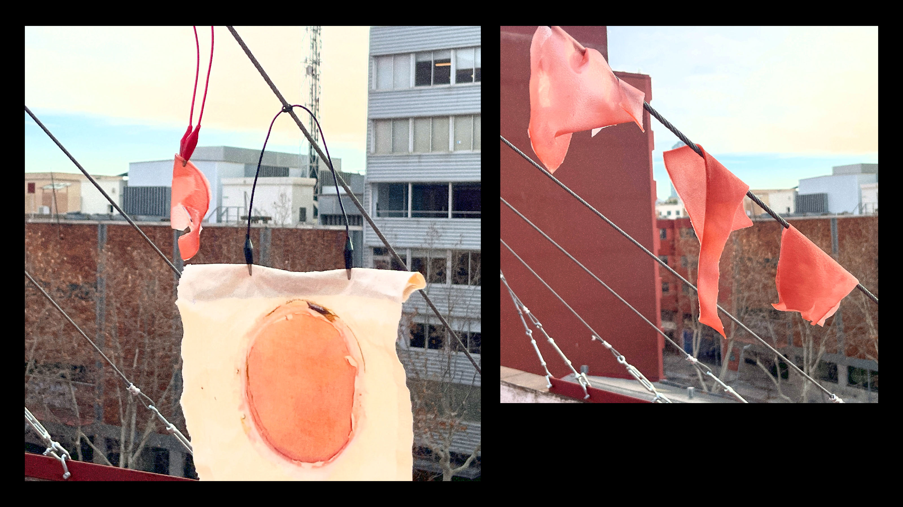
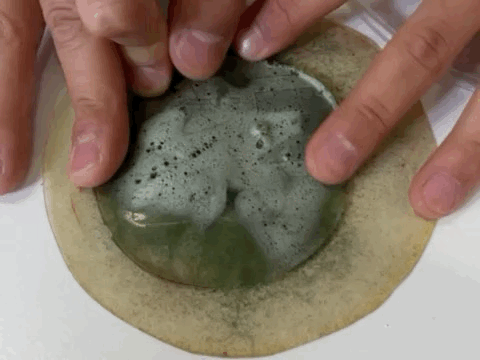

# Digital Prototyping for Design 

!!! info 
    
    **==FACULTY==**: Josep Marti, Santi Fuentemilla    

    **==CALENDAR==**: 17-01 → ...

    **==TRACK==**: Application

!!! note ""

## **Laser Cut & Biomaterials**

!!! info "**Team**"

    Annna Lozano & Nicolò Baldi

### Introduction: Soft Robotics
Subfield of robotics, that integrates compliant materials, soft and flexible, instead of rigid and stiff ones, into its fabrication. This difference in materiality is what allows the parts and links of robots, and by that, their functioning and purpose, to act and perform in different environments, handling things with great care, and by that, bringing them closer to human interaction.

### **Recipes**

==#1 AGAR AGAR BASED==

: > Water 300ml | Agar agar 10g | Glicerine: 32g | (+ Micca) 

: 
: We tried to let the Agar Agar based recipe in 3 different materials: acrylic (mold), textile and a canvas.
The samples dried quickly and the recipe turned out not to be elastic enough. 
All of them, especially the one in the mold, shrinked  or got broken.

: !!! tip "Comment"
        In our case agar agar was not good for a soft robot... 	(⇀‸↼‶)

==#2 GELATINE BASED==

:   > Water: 240 ml | Gelatine: 48g | Glicerine: 48g | (+ Spirulina|Micca)

: 
: We found this recipe in the documentation from a previous Fabacademy student (), which used this combination to create bio-based soft robots. 
We recreated it in different varieties and it proved to be exceptional for the scope.
As we did for the Agar agar recipe, we let the material dry on different materials: an acrylic mold, a sheet of acrylic with a very thin layer of textile and on textile.

: - ==Acrylic mold==: This proved to be the most flexible and versatile, also the material didn’t shrink in the mold.
: - ==Acrylic + Textile==: This was impossible to take away from the textile because of the thin thickness of the material, so it eventually remained embedded to it.
: - ==Textile==: This one turn out very resistent, but not very flexible. It might me good for other applications though.

: !!! tip "Comment"
        
        Since we figured out that the technique on the acrylic sheet was the one working best, we recreated the experiment but this time without any textile. 
        The material turned out very transparent, flexible and with unexpected different thicknesses, which gave us the chance to make different experiments. We also recreated the recipe this time combining it with micca.

==#3 ALGINATE SODIUM BASED==

: > Water: 100ml | Alginate Sodium: 6g | Glicerine: 15ml

:  
At the same time, we tried two different recipes with Alginate Sodium, so non heat-cooking recipes.
We let the material rest on two surfaces: textile and a mold.
    
: !!! tip "Comment"
        In both cases we realized how adding vegetal carbon to the mixture was turning the material drier.

!!! note ""

### **Soft Robotics Techinques**

==#1 MOLD TECHNIQUE==

: {: .image-45-size-left} {: .image-45-size-right} 

: We first tried with a mold, leaving some space on the inside to let the air inflate, and a thinner layer to close the structure. We then used gelatine and pressed the structure for 1 night to attach the two layers together.

: !!! tip "Comment"
        Comment: Even tough the other layer was a bit too thick, and the thin one was not so flexible, we managed to inflate the soft robot. The gelatine-glue technique worked but the soft-robot still has some leaks.

==#2 LASER WELDING TECHNIQUE==

: 

: We saw some documentation about welding thin layers of plastic together, this could be done with soldering iron or through the light beam of the laser cutter. So we tried with different parameters to gain results but it turned out to be very quickly. This process is in fact influenced both by the machine parameters (such as speed, power, focus) and by the material features, mostly regarding its thickness. 

: !!! tip "Comment"
        After some attempts, we realized how the technique has potential but needs a lot of time and attention to find the correct equilibrium in between parameters in action. We think that maybe an appropriate research on the field could be interesting and we may try that again soon.
        Also, the focus parameter is probably the most important, since the width of the light beam really influenced the outcome of the eperiments.

==#3 HEAT PRESS TECHNIQUE==

: 

: In a previous workshop I attended with Marisa Satsia, I explored another technique which involves the use of a heat press to fuse layers of bioplastics. The first step is to laser cut oven paper into various designs, which eventually will become the inflating surface of the structure. This paper layers go in between two sheets of bioplastics, and then the whole structure is set under the heat press: the process gently merge the areas where the bioplastics are in contact, not affecting where paper has been placed. 

: !!! Tip "Comment"
        This process is surely the most recommended, because it turned out to be very fast and easy. For this reason we had the chance to try multiple attempts, refining the designs to guide the airflow in the desired direction.
        Even tough this approach is not as accurate as a welding, by using some tips it’s possible to let the soft robot inflate as you wish.   

### **References**
- https://class.textile-academy.org/2022/saskia-helinska/finalproject.html
- https://www.youtube.com/watch?v=TyYW9BmMeSs
- https://docs.google.com/presentation/d/1IFUEMU1zup2H0o8XDK_0g92k_M4WFhZScZb3wSIjH84/edit#slide=id.g1a63d847bb9_0_0

!!! note ""
