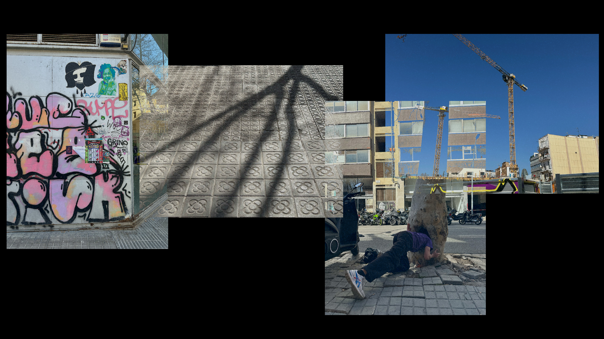

# Design with Extended Intelligences

!!! info 
    
    **==FACULTY==**: Christian Ernst, Pietro Rustici    

    **==CALENDAR==**: 27-02 → 01-03

    **==TRACK==**: Exploration

!!! tip ""
    ## **Introduction**
    During this week we delved into a functional and critical exploration of Generative AI.

!!! note ""

## **Human-Human Interaction vs Human-AI Interaction**

First of all, we were asked to play a simple game in groups about guessing a "fake" coin out of 12. 
The rule was to have 3 chances to guess this coin by asking the only person in the group in which one of the selected groups was this. 
We tried different strategies, from splitting the group in 2 sequencially or to create couples or triplets of coins to measure excluding others, giving more space to luck.

Then we repeated the experiment with ChatGPT-4: initially the AI model was explaining us the rules of our own game, but after some adjustements to the prompt we managed to play with it! 
Here's the initial code: 

!!! question ""
    
    I have 12 coins. One weighs lighter than the other, and I am the only one who knows which one is the light one. You have to use probability to guess which one is the light one and play the game with me step by step. So, for example, you would say, Step 1, divide these 12 coins into two groups. And then you would say, Group A has the anomaly coin, and then I will tell you yes or no. And if it's a yes, then we continue. If it's a no, then we continue forward like that.
    You have only three tries to weight the groups, and at the end of this process you have to guess the coin. Let's play.

!!! example ""

    Alright, let's specify the coins for each group and choose which groups to compare in the first weighing.

    Assigning Coins to Groups
    Group A: Coins 1, 2, 3, 4
    Group B: Coins 5, 6, 7, 8
    Group C: Coins 9, 10, 11, 12
    First Weighing
    Weighing 1: Compare Group A against Group B.

    Please tell me the outcome: is Group A lighter, Group B lighter, or are they equal?

!!! question ""

    They are equal, so you have only 2 other chances left to guess the number

!!! example ""

    Since Groups A and B are equal in weight, we know the lighter coin is in Group C, which includes Coins 9, 10, 11, and 12.

    Step 2: Divide Group C into three smaller groups
    To proceed, we will divide Group C as follows for our second weighing:

    New Group A: Coin 9
    New Group B: Coin 10
    Single Coin (for comparison): Coin 11
    Remaining Coin: Coin 12 (will not be weighed this time)
    Second Weighing
    Weighing 2: We will weigh New Group A (Coin 9) against New Group B (Coin 10).

    If one of these groups is lighter, we know that's the lighter coin. If they balance, then the lighter coin has to be either Coin 11 or Coin 12.

    Please tell me the outcome of this second weighing.

!!! question ""

    Ok! the lighter one is 10, you got it!

It's interesting to see that ChatGPT-4 went directly for the multiple groups strategy, and managed (with a bit of luck) to solve the puzzle in just two steps!

!!! note ""

## **Exploration**

!!! info "**Team**"
     Everardo Castro, Nicolò Baldi, Qianyin Du

We then explored the possibilities of Generative AI by using a tool developed by DOTTOD, the [DOTTOD Camera](https://camera.dottod.net/camera). The goal was to shot some pictures around the neighbourhood and see how this tool powered by DALL•E could process the original images through our prompts. Here is the collection of the pictures that we shot:

This idea reminded me of the [Paragraphica](https://bjoernkarmann.dk/project/paragraphica) project as well: here the artist developed a camera that delivers an hybrid picture, which considers the real-time data of the shot processed by AI.

!!! note ""

## **Presentation**

<iframe 
    src="https://docs.google.com/presentation/d/e/2PACX-1vRCEAKtLrddyYzd4zVLS_XmRyrmHRGYBBbnuV0HuqMbogN53jAJpV8d8dPy7tuUDyMElkmA_DlQos9c/embed?start=false&loop=false&delayms=3000" 
    frameborder="0" 
    width="100%" 
    height="400" 
    allowfullscreen="true" 
    mozallowfullscreen="true" 
    webkitallowfullscreen="true">
</iframe>

!!! note ""

