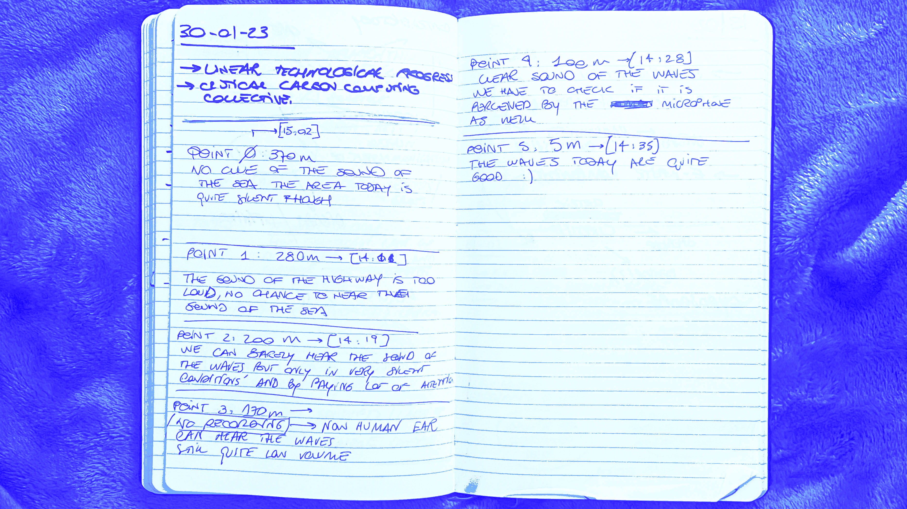

# Measuring the World

!!! info 
    
    **==FACULTY==**: Oscar Gonzalez, Guillem Camprodon    

    **==CALENDAR==**: 06-02 → 09-02

    **==TRACK==**: Exploration

!!! tip ""
    ## **Introduction**
    This seminar aimed to introduce us to the world of data, shedding light on the entire process upon which our data-driven society relies on: from conception and collection to the selection of tools and the visualization of data itself. We had the chance to learn about useful public databases and tools for data analysis, enabling us to incorporate a more comprehensive view into our projects.

!!! note ""

!!! info "**Team**"
    Albert Vila Bonfill, Anthuanet Falcon, Flora Berkowitz, Manuja Agnihotri, Nicolò Baldi 

!!! example "**Repository**"
    https://gist.github.com/niente010/fd372f57fe3705cf3d11fa1af1236776

## **Presentation**

<iframe src="https://docs.google.com/presentation/d/e/2PACX-1vSZtivQuxINoEJJEq0CZNooLLts8k-cPOOm2hRXW7us2ohm9G_VCL8YGVxwE6HhNdpe5DrxKVvlpJcr/embed?start=false&loop=false&delayms=3000" 
frameborder="0" 
width="100%" 
height="400" 
allowfullscreen="true" 
mozallowfullscreen="true" 
webkitallowfullscreen="true"></iframe>

!!! tip ""
    ## **Reflections**
    

    I initially had the feeling that data created a certain ==distance between the phenomena and those who analyze it==. However, this seminar has shown me that being part of the data generation process can offer a much deeper connection.

    We learned about the amount of steps involved in data collection, even for a simple data such as the amount of sound. Using the Smart Citizen Kit required a ==process of trial and error==, often failing to collect data due to technical issues or misuse of the tool. This forced us to repeat the experiment multiple times, ending up feeling the collection of the data itself in our very hands. I’d say ==the data got its materiality== in a way. 

    I’ve also realised for the first time how sometimes ==our bodies can act as a technology for detecting data==. 
    While it may not be universal or the most empirical method, it has proven over centuries to be one of the most effective ways to perceive the world. In fact, the only experiment which “didn’t fail” during the first attempt involved actively listening to sea waves at different points. ==while the sensor was capturing the amount of sound, we also stood silent in a collective listening== trying to detect the desired sound simply with our ears. 
    We then described subjectively the results in my notebook, trying to translate our auditory experience into words.

    This methodology was particularly interesting because I felt like both ==our group and the sensor collaborated to gain a more comprehensive understanding of the situation==. Distinguishing sea wave sounds from the overall noise spectrum might require a powerful AI trained to identify these patterns, whereas for us, it only required focused listening. However, we lack the means to store and replay our auditory records and lack an empirical method to translate and compare this data.

    So I think this is my favourite takeaway of this seminar: ==devices and tools are not the only ways to measure the world==. These instruments are crucial, but we should not overlook the other means of perceiving the unknown, such as ancestral knowledge, body sensitivity, and the observation of natural phenomena.