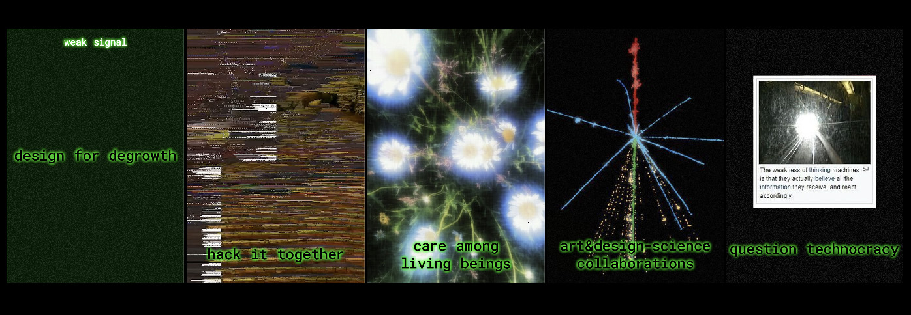

---
hide:
    - toc
---

# Atlas of Weak Signals 2

!!! info 
    
    **==FACULTY==**: Jessica Guy, Olga Trevisan    

    **==CALENDAR==**: 03-04

    **==TRACK==**: Exploration

!!! note ""

## **Proposed Cards**

==DESIGN FOR DEGROWTH== 
:   Degrowth promotes sustainability over economic growth, encouraging designs that minimize waste and support a circular economy. Designers are urged to create durable, repairable tools with minimal environmental impact.

==HACK IT TOGETHER== 
:   DIY strategies and hacking emphasize democratizing technology and empowering individuals to modify and repair devices. This material practices enhances community collaboration and encourages self-sufficiency and creativity.

==CARE AMONG LIVING BEINGS== 
:   Design must consider the ecological impact also through emotionally resonant materials. Addressing extractivism, designers should opt for renewable, biodegradable, and ethically sourced materials.

==ART&DESIGN-SCIENCE COLLABORATIONS== 
:   Interdisciplinary collaboration between art, design, and science can lead to innovative solutions for complex issues. This approach ensures that scientific knowledge is accessible and engaging, diffused through the power of narrative and aesthetic.

==QUESTION TECHNOCRACY== 
:   Technocracy often overlooks the political, ethical and ecological implications of technological development. Designers must critically evaluate the role of technology, advocating for transparency, accountability and user empowerment.

!!! note ""

