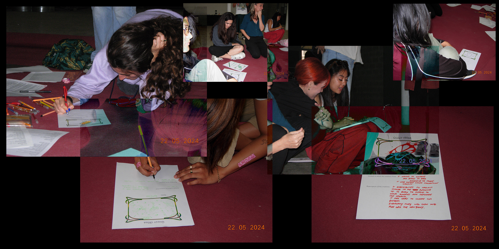
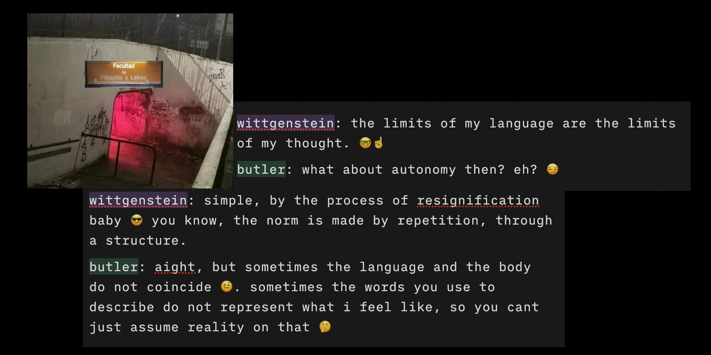

---
hide:
    - toc
---

# Critical Transfeminist Design 

!!! info 
    
    **==FACULTY==**: Laura Benitez 

    **==CALENDAR==**: 22-05

    **==TRACK==**: Reflection

!!! tip ""
    ## **Introduction** 
    An exploration on how transfeminist perspectives can reshape design through critical principles, ethics of care, and biohacking. The goal is to discuss ethical issues and new relationships with technology.

## **Un dìa en Hangar**

## **Un dìa en Clase**

{: .image-half-size-ctr }

!!! note ""
